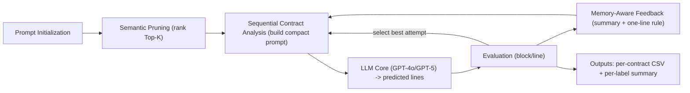

# LineGuard: Memory-Aware Line-Level Vulnerability Localization for Solidity

> A compact, multi-attempt, feedback-driven LLM framework that **localizes smart-contract vulnerabilities at the line (and block) level** with audit-grade traceability.

---

## LineGuard: An LLM-Based Smart Contract Vulnerability Detection

Smart contracts face sophisticated attacks that cause large financial losses. Traditional static and symbolic analyzers typically operate at function/contract granularity and struggle to pinpoint the exact vulnerable line. **LineGuard** is a hybrid *LLM-in-the-loop* framework that performs **fine-grained line-level localization** by combining:
1. **Semantic pruning** of candidate lines  
2. **Memory-aware smart feedback** for iterative self-correction  
3. **Deterministic, reproducible evaluation** at both block and line levels  

On a corpus of **350 Solidity contracts** across seven vulnerability categories, **LineGuard (GPT-5)** reduces **false negatives by up to _85%_**, improves line-level **F1** (e.g., _0.69 → >0.83_ vs. GPT-4o), and sustains **~0.89 average precision** — producing stable, audit-ready reports.

---

## Architecture Overview

LineGuard is a **closed-loop reasoning pipeline** with five modular components:

1. **Prompt Initialization** – Loads label-specific rules and initializes evaluation parameters  
2. **Semantic Pruning** – Extracts and ranks Top-K candidate lines via lexical and structural heuristics  
3. **Sequential Contract Analysis** – Builds compact prompts and orchestrates multi-attempt reasoning  
4. **LLM Core (GPT-4o / GPT-5)** – Performs controlled inference and prediction selection  
5. **Memory-Aware Feedback** – Summarizes reasoning history, distills a one-line corrective rule, and injects concise guidance into subsequent attempts

---

##Installation

Requires Python 3.9+
# 1. (Recommended) create a virtual environment
python -m venv .venv && source .venv/bin/activate     # Linux/Mac
# or
.\.venv\Scripts\activate                              # Windows PowerShell

# 2. Install dependencies
pip install pandas openai
Set your OpenAI API key:
$env:OPENAI_API_KEY = "<YOUR_KEY>"
Model selection: Edit BASE_MODEL in the script ("gpt-5" or "gpt-4o")
Quickstart
Test Mode (5-contract demo)
python smartguard_user_feedback_system_predictions_only_vfinal.py \
  --mode test \
  --results_root ./results \
  --memory_root ./memory \
  --api_key $OPENAI_API_KEY
Real Mode (single label)
python smartguard_user_feedback_system_predictions_only_vfinal.py \
  --mode real \
  --contracts_root ./buggy_contracts \
  --results_root ./results \
  --memory_root ./memory \
  --api_key $OPENAI_API_KEY \
  --threshold 0.7 --max_attempts 3 --history_turns 4 \
  --condense_window 5 --topk_candidates 40 \
  --block_dilation 1 --block_eval dilated \
  --line_tolerance 0 --early_stop block \
  --smart_feedback llm --fb_history_k 12 --fb_max_chars 600 \
  --fb_rule_chars 180 --mem_max_msgs 120 --mem_keep_recent 24 --distill_every 10 \
  --label_index 3 --limit_contracts 50
Real Mode (all labels)
python smartguard_user_feedback_system_predictions_only_vfinal.py \
  --mode real --all_labels \
  --contracts_root ./buggy_contracts \
  --results_root ./results \
  --memory_root ./memory \
  --api_key $OPENAI_API_KEY
CLI Reference
| Argument            | Type / Range                                       | Default   | Description                            |
| ------------------- | -------------------------------------------------- | --------- | -------------------------------------- |
| `--mode`            | `real` / `test`                                    | `real`    | Full run or demo                       |
| `--contracts_root`  | Path                                               | —         | Root with labeled contract folders     |
| `--results_root`    | Path                                               | —         | Output directory for results           |
| `--memory_root`     | Path                                               | —         | Memory JSON output path                |
| `--api_key`         | String                                             | —         | OpenAI API key                         |
| `--threshold`       | Float [0–1]                                        | 0.7       | Early-stop precision/recall threshold  |
| `--max_attempts`    | Int                                                | 3         | Max prediction attempts per contract   |
| `--history_turns`   | Int                                                | 4         | Number of previous messages to include |
| `--condense_window` | Int                                                | 5         | Snippet radius for compact prompts     |
| `--topk_candidates` | Int                                                | 40        | Max candidate lines                    |
| `--block_eval`      | `hit` / `dilated` / `overlap`                      | `dilated` | Block-level eval mode                  |
| `--line_tolerance`  | Int                                                | 0         | ± tolerance for line-level matching    |
| `--early_stop`      | `block` / `line` / `any` / `perfect_line` / `both` | `block`   | Early stopping policy                  |
| `--smart_feedback`  | `off` / `local` / `llm`                            | `llm`     | Feedback generation strategy           |
| `--fb_history_k`    | Int                                                | 12        | How many feedbacks to summarize        |
| `--fb_max_chars`    | Int                                                | 600       | Char limit for feedback summary        |
| `--fb_rule_chars`   | Int                                                | 180       | Max chars for one-line rule            |
| `--mem_max_msgs`    | Int                                                | 120       | Prune memory beyond this size          |
| `--mem_keep_recent` | Int                                                | 24        | Keep recent N messages after pruning   |
| `--distill_every`   | Int                                                | 10        | Distill cadence (per label)            |
| `--label_index`     | Int [1–7]                                          | —         | Select one vulnerability label         |
| `--limit_contracts` | Int                                                | 50        | Limit number of contracts per run      |
| `--all_labels`      | Flag                                               | off       | Process all categories                 |

---

## Results Summary

Dataset: 350 contracts × 7 categories

LineGuard (GPT-5) achieved:

85% reduction in false negatives vs. static tools (Oyente, Mythril, Securify, etc.)

F1 improvement: 0.69 → 0.83+

Average precision: ≈0.92%

Stable performance across execution-sensitive vulnerabilities (Re-entrancy, TOD)

Ethical & Security Disclaimer

This framework is for academic and research purposes only.
LLM outputs are not guaranteed to be accurate. Always audit flagged lines manually before deployment.
Do not upload proprietary or sensitive code to external APIs.

---

## License

Apache 2.0

---
