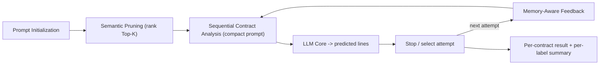

# LineGuard: An LLM-Based Smart Contract Vulnerability Detection

LineGuard is a multi-attempt, feedback-driven LLM framework that **localizes smart-contract
vulnerabilities at the exact line** (and block) of Solidity source code. Traditional static and
symbolic analyzers usually report at function or contract granularity; LineGuard names the vulnerable
lines by combining:

1. **Semantic pruning** of candidate lines
2. **Memory-aware feedback** for iterative self-correction across attempts
3. **Label-free (non-oracle) evaluation**, so reported results use no ground-truth information

On 315 evaluation contracts across seven vulnerability categories, LineGuard with **Claude Sonnet 5**,
evaluated without any ground-truth assistance, reaches a macro-averaged line-level **F1-score of 0.837**
and misses **39.6% fewer injected bugs** than an earlier oracle-assisted GPT-4o configuration on the same
contracts.

---

## Architecture

LineGuard is a closed-loop reasoning pipeline with five components:

1. **Prompt Initialization**: loads label-specific rules and the run configuration
2. **Semantic Pruning**: extracts and ranks the Top-K candidate lines with lexical and structural heuristics
3. **Sequential Contract Analysis**: builds a compact prompt from the candidate snippets and feedback
4. **LLM Core**: calls the configured model and parses a strict, digits-only list of line numbers
5. **Memory-Aware Feedback**: summarizes earlier attempts into concise guidance for the next attempt


```mermaid
flowchart LR
    A["Prompt Initialization"] --> B["Semantic Pruning (rank Top-K)"]
    B --> C["Sequential Contract Analysis (compact prompt)"]
    C --> D["LLM Core -> predicted lines"]
    D --> E["Stop / select attempt"]
    E -->|next attempt| F["Memory-Aware Feedback"]
    F --> C
    E --> G["Per-contract result + per-label summary"]
```

### Oracle and non-oracle modes

* **Oracle mode** (`--oracle on`): feedback, early stopping and attempt selection use scores computed
  from the ground truth. This is an upper bound and is not available when auditing unlabelled code.
* **Non-oracle mode** (`--oracle off`): feedback comes from agreement between the model's own attempts
  and fixed per-label heuristics, the reported attempt is chosen by that agreement, and iteration stops
  when predictions converge. The ground truth is used only afterwards, to score the result.

### Evaluation protocol used for the reported results

Applied identically to every category (`--warmup_contracts 5 --oracle off`):

* **Warm-up**: contracts 1 to 5 run in oracle mode only to fill the feedback memory. They are excluded
  from every reported metric.
* **Evaluation**: contracts 6 to 50 run in non-oracle mode. No score derived from the ground truth is
  written to memory during this phase. All reported numbers use these 45 contracts per category.

---

## Installation

Requires Python 3.9 or later.

```bash
python -m venv .venv && source .venv/bin/activate
pip install pandas anthropic openai
```

Choose a model backend:

| Provider | Flag | Authentication |
| --- | --- | --- |
| Claude Code CLI (used for the reported results) | `--provider claude_cli` | Install the CLI and run `claude auth login` |
| Anthropic API | `--provider anthropic` | `ANTHROPIC_API_KEY`, or a profile from `ant auth login` |
| OpenAI API | `--provider openai` | `--api_key` |
| OpenRouter, Gemini, Groq | `--provider openrouter` / `gemini` / `groq` | `--api_key` |

---

## Quickstart

### Reproduce the reported evaluation, one label at a time

```bash
scripts/run_all_labels.sh 1
```

Label indexes: 1 Re-entrancy, 2 Timestamp-Dependency, 3 Unchecked-Send, 4 Unhandled-Exceptions,
5 TOD, 6 Overflow-Underflow, 7 tx.origin. The script writes to `results_sonnet_v2/` and
`memory_sonnet_v2/`. It is safe to rerun: completed contracts are skipped, and if a usage limit is
reached the run stops cleanly (exit code 75) and resumes from the first unfinished contract.

### Run `main.py` directly

```bash
python3 main.py --mode real --provider claude_cli --model claude-sonnet-5 \
  --contracts_root ./buggy_contracts \
  --results_root ./results --memory_root ./memory \
  --label_index 1 --limit_contracts 50 \
  --warmup_contracts 5 --oracle off --resume \
  --threshold 0.7 --max_attempts 3 --early_stop block \
  --topk_candidates 40 --condense_window 5 \
  --block_eval dilated --block_dilation 1 --line_tolerance 0 \
  --smart_feedback llm
```

### Recount the analysis-tool baselines

```bash
git clone --depth 1 https://github.com/DependableSystemsLab/SolidiFI-benchmark
python3 scripts/baseline_fn.py SolidiFI-benchmark/results reports/baseline_fn_6_50.json 6 50
```

This recomputes the missed bugs of Oyente, Securify, Mythril, SmartCheck, Manticore and Slither on
any contract range from the tool reports published by SolidiFI. On all 50 contracts it reproduces 17 of
the 26 published totals exactly and the remaining nine within 2.7%.

---

## CLI reference

| Argument | Values | Default | Description |
| --- | --- | --- | --- |
| `--mode` | `real` / `test` | `real` | Full run or 5-contract demo |
| `--contracts_root` | path | | Root of the labeled contract folders |
| `--results_root` | path | | Output directory for results and logs |
| `--memory_root` | path | | Output directory for feedback memory |
| `--provider` | `openai` / `anthropic` / `claude_cli` / `gemini` / `groq` / `openrouter` | `openai` | Model backend |
| `--model` | model id | per provider | For example `claude-sonnet-5` or `gpt-4o` |
| `--api_key` | string | | Required for OpenAI-compatible providers |
| `--oracle` | `on` / `off` | `on` | Use ground truth for feedback, stopping and selection |
| `--warmup_contracts` | int | 0 | First N contracts per label run in oracle mode and are excluded from metrics |
| `--resume` | flag | off | Skip contracts that already have a saved result |
| `--label_index` | 1 to 7 | prompt | Vulnerability label to process |
| `--limit_contracts` | int | 50 | Contracts per label |
| `--all_labels` | flag | off | Process all labels in one run |
| `--threshold` | float 0 to 1 | 0.7 | Early-stop precision/recall threshold (oracle mode) |
| `--max_attempts` | int | 3 | Maximum attempts per contract |
| `--early_stop` | `block` / `line` / `any` / `perfect_line` / `both` | `block` | Early-stopping policy (oracle mode) |
| `--topk_candidates` | int | 40 | Candidate lines kept after pruning |
| `--condense_window` | int | 5 | Snippet radius around each candidate |
| `--block_eval` | `hit` / `dilated` / `overlap` | `dilated` | Block-level scoring mode |
| `--block_dilation` | int | 1 | Dilation width for `dilated` block scoring |
| `--line_tolerance` | int | 0 | Tolerance for line-level matching |
| `--smart_feedback` | `off` / `local` / `llm` | `llm` | Feedback-rule generation |
| `--history_turns` | int | 4 | Previous predictions included per attempt |
| `--fb_history_k` | int | 12 | Recent feedback entries summarized |
| `--fb_max_chars` / `--fb_rule_chars` | int | 600 / 180 | Feedback length limits |
| `--mem_max_msgs` / `--mem_keep_recent` / `--distill_every` | int | 120 / 24 / 10 | Memory pruning controls |
| `--ablation` | `full` / `single_shot` / `pruning_only` / `feedback_only` | `full` | Component ablation presets |
| `--use_pruning` / `--use_feedback` | `on` / `off` | preset | Override individual components |
| `--num_runs` / `--seed` | int | 1 / none | Repeated runs with isolated state; seed where supported |

Every model call is logged per label in `<label>_usage.csv` with provider, resolved model id, prompt and
completion tokens, latency and estimated cost.

---

## Results

Claude Sonnet 5 through the Claude Code CLI, non-oracle mode, 45 evaluation contracts per category.
GPT-4o results come from an earlier oracle-mode run of the same framework, re-scored on the same
contracts against the corrected annotations, so that reference is favourable to GPT-4o.
Line-level metrics are macro averages over contracts.

| Category | Line precision | Line recall | Line F1 | GPT-4o line F1 (oracle) | Missed bugs, Sonnet 5 | Missed bugs, GPT-4o | Strongest tool (missed) |
| --- | --- | --- | --- | --- | --- | --- | --- |
| Re-entrancy | 0.700 | 0.901 | **0.779** | 0.728 | 156 / 1235 | 451 / 1235 | Slither (0) |
| Timestamp-Dependency | 0.970 | 0.758 | **0.845** | 0.751 | 51 / 1272 | 142 / 1272 | Slither (490) |
| Unchecked-Send | 0.955 | 0.991 | 0.972 | **0.986** | 9 / 1154 | 15 / 1154 | Mythril (321) |
| Unhandled-Exceptions | 0.929 | 0.937 | **0.931** | 0.825 | 112 / 1265 | 349 / 1265 | Slither (422) |
| TOD | 0.698 | 0.453 | **0.547** | 0.522 | 403 / 1227 | 441 / 1227 | Securify (263) |
| Overflow-Underflow | 0.930 | 0.832 | **0.862** | 0.791 | 361 / 1223 | 465 / 1223 | Oyente (814) |
| tx.origin | 0.920 | 0.921 | **0.921** | 0.918 | 92 / 1228 | 97 / 1228 | Slither (0) |
| **Macro average** | **0.872** | **0.828** | **0.837** | 0.789 | **1184 / 8604** | 1960 / 8604 | |

* LineGuard misses fewer injected bugs than every supported analysis tool in four categories.
  Slither is stronger on Re-entrancy and tx.origin, and Securify on TOD.
* Cost on the 315 evaluation contracts: 696 model calls (2.21 per contract), 5.50 million tokens,
  13.1 seconds and USD 0.071 per contract at list prices.
* Stability: agreement between consecutive attempts averages 0.953 across categories, and 79.0% of
  contracts converged before the third attempt. Each configuration was run once, so run-to-run
  variance was not measured.

Full analysis data and reports are in `reports/`; per-contract predictions, usage and logs are in
`results_sonnet_v2/`.

---

## Repository layout

| Path | Contents |
| --- | --- |
| `main.py` | LineGuard pipeline |
| `buggy_contracts/` | Dataset: 350 contracts with line-level annotations and the SHA-256 manifest |
| `scripts/run_all_labels.sh` | Runs one label with the reported evaluation protocol |
| `scripts/baseline_fn.py` | Recounts analysis-tool false negatives from SolidiFI reports |
| `scripts/compare_sonnet_gpt4o.py` | Per-contract comparison with the GPT-4o run |
| `results_sonnet_v2/`, `memory_sonnet_v2/` | Outputs of the reported Claude Sonnet 5 runs |
| `reports/` | Analysis JSON and comparison reports |

---

## Dataset provenance and integrity

The line-level ground-truth dataset lives in `buggy_contracts/` and consists of **350 contracts**,
50 in each of the 7 vulnerability categories (Re-entrancy, Timestamp-Dependency, Unchecked-Send,
Unhandled-Exceptions, TOD, Overflow-Underflow, tx.origin). Each contract `buggy_{i}.sol` is paired
with its annotation `BugLog_{i}.csv`.

* **Origin.** The contracts derive from the SolidiFI benchmark, which provides block-level
  vulnerability spans. The exact line-level annotations in `BugLog_{i}.csv` were produced by manual
  auditing for this work.
* **Line numbering.** 1-based (the first line of a file is line 1). Blank and comment-only lines are
  counted in the numbering; they are simply ignored by the candidate-extraction heuristics.
* **Corrections.** Before the reported experiments all 350 annotation files were checked
  programmatically, and six were corrected: two headers missing the `line` column, one row missing its
  line value, and three line values outside their injected span.
* **Integrity.** `buggy_contracts/SHA256SUMS.txt` lists the SHA-256 digest of all 700 dataset files.
  Verify a copy with:

  ```bash
  cd buggy_contracts && shasum -a 256 -c SHA256SUMS.txt
  ```

  The manifest itself has SHA-256
  `8752bb31190694557a356ef9269030f7ed64e598774c22f31fffb0b1720e5255`.

---

## Disclaimer

This framework is for academic and research purposes only. LLM outputs are not guaranteed to be
accurate; always audit flagged lines manually. Do not send proprietary or sensitive code to external
model APIs without authorization.

## License

Apache License 2.0; see [LICENSE](LICENSE). This covers both the source code and the line-level
annotations released in `buggy_contracts/`.
